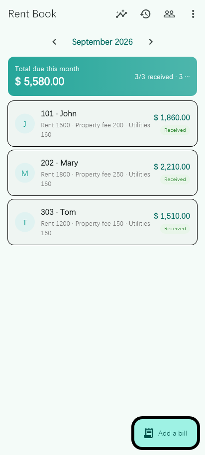
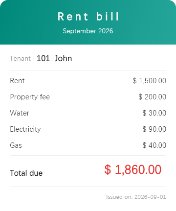
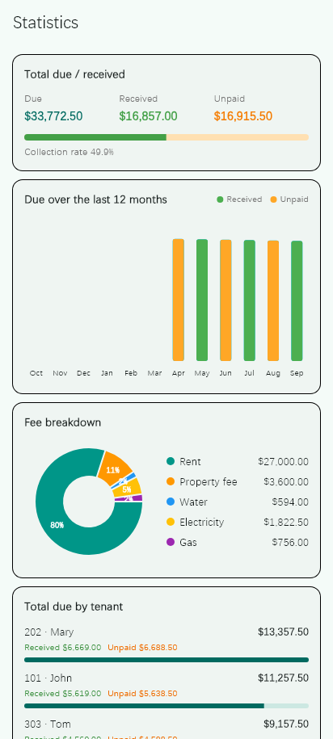
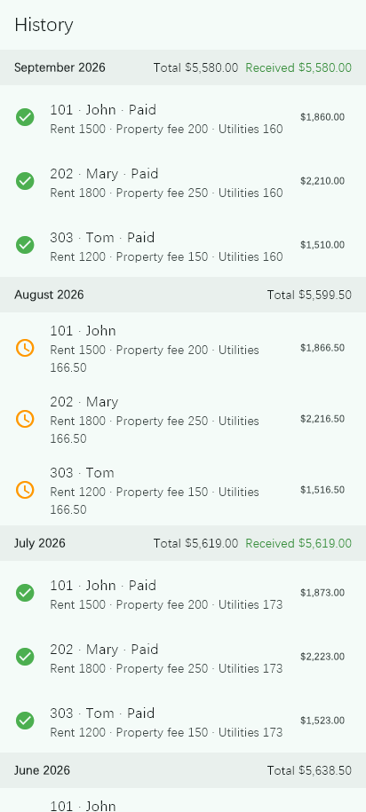
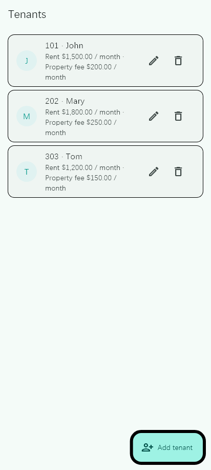

**English** | [简体中文](README.md)

<div align="center">

# Rent Book

**A minimal rent ledger for landlords**<br>
Track rent, property fees, and utilities month by month — and share a bill image with your tenant in one tap.

[](https://github.com/oliverchu/rent_book/actions/workflows/ci.yml)
[](https://flutter.dev)
[](https://dart.dev)
[](LICENSE)
[](#-supported-platforms)





</div>

---

## ✨ Features

| | |
|---|---|
| 🏠 **Tenant management** | Room, name, fixed rent and property fee — add, edit, delete |
| 🧾 **Monthly billing** | One bill per tenant per month: rent / property fee / water / electricity / gas + note, with paid / unpaid status |
| 🗂 **History** | Grouped by month in reverse order, showing the monthly total and amount received |
| 📊 **Statistics** | Total due / received / unpaid with collection rate, 12-month trend, fee breakdown pie, tenant ranking |
| 🖼 **Bill sharing** | Render a bill as an image and share it through the system share sheet (WeChat, etc.) |
| 🔒 **Startup password** | Set / change a startup password; the app re-locks when it returns from the background |
| 🌐 **Multi-language** | English / 简体中文 / 日本語 / 한국어, switchable in-app (follows the system by default) |
| 💱 **Multi-currency** | CNY ¥ / USD $ / JPY ¥ / KRW ₩, switchable in-app (follows the language by default) |

## 📸 Screenshots

<table>
  <tr>
    <td></td>
    <td></td>
    <td></td>
  </tr>
  <tr>
    <td align="center">Home · monthly summary</td>
    <td align="center">History</td>
    <td align="center">Statistics</td>
  </tr>
  <tr>
    <td></td>
    <td></td>
    <td></td>
  </tr>
  <tr>
    <td align="center">Tenants</td>
    <td align="center">Bill card</td>
    <td></td>
  </tr>
</table>

## 🚀 Getting Started

### Requirements

- Flutter **3.47.1** or newer (Dart 3.13+)
- Android: Android Studio / Android SDK
- Windows: Visual Studio 2022 with the "Desktop development with C++" workload

### Run

```bash
git clone https://github.com/oliverchu/rent_book.git
cd rent_book
flutter pub get
flutter run          # pick an Android device or Windows
```

### Test & analyze

```bash
flutter analyze
flutter test
```

## 📦 Build

### Android

```bash
# Debug build
flutter build apk --debug

# Release build (configure signing first, see below)
flutter build apk --release          # single APK
flutter build appbundle --release    # AAB for Google Play
```

Output: `build/app/outputs/flutter-apk/app-release.apk` or
`build/app/outputs/bundle/release/app-release.aab`

#### Signing

Copy the template and fill in the real values (`android/key.properties` is ignored by `.gitignore`):

```bash
cp android/key.properties.example android/key.properties
```

```properties
storePassword=your-keystore-password
keyPassword=your-key-password
keyAlias=upload
storeFile=upload-keystore.jks
```

Create a keystore:

```bash
keytool -genkey -v -keystore android/app/upload-keystore.jks \
  -keyalg RSA -keysize 2048 -validity 10000 -alias upload
```

> Without `key.properties`, release builds fall back to debug signing so you can still build locally.

### Windows

```bash
flutter build windows --release
```

Output: `build/windows/x64/runner/Release/rent_book.exe`

## 🌐 Localization

Strings live in `lib/l10n/app_*.arb`. After editing them, regenerate:

```bash
flutter gen-l10n
```

The generated `lib/l10n/app_localizations*.dart` files are committed.
Supported locales: `en` / `zh` / `ja` / `ko`.

## 🧱 Project Structure

```
lib/
├── data/          # Data sources & repositories (SQLite, SharedPreferences, settings)
│   ├── datasources/
│   ├── repositories/
│   └── services/
├── domain/        # Models (Tenant / Bill / Currency)
├── ui/
│   ├── core/      # Shared widgets, money/date formatting, currency scope
│   ├── features/  # auth / home / tenants / bill_edit / bill_share / stats
│   └── router/    # go_router routes
└── l10n/          # ARB strings and generated localization code
```

## 🛠 Tech Stack

| | |
|---|---|
| UI | Flutter 3.47 · Material 3 |
| State management | [provider](https://pub.dev/packages/provider) |
| Routing | [go_router](https://pub.dev/packages/go_router) |
| Local storage | [sqflite](https://pub.dev/packages/sqflite) (via [sqflite_common_ffi](https://pub.dev/packages/sqflite_common_ffi) on desktop) · [shared_preferences](https://pub.dev/packages/shared_preferences) |
| Charts | [fl_chart](https://pub.dev/packages/fl_chart) |
| Sharing | [share_plus](https://pub.dev/packages/share_plus) |
| Localization | flutter_localizations · intl |

## 🔐 Data & Privacy

- Everything (tenants, bills, password hash, language/currency settings) is stored **locally** — no network, no upload.
- Bills live in a SQLite database; the startup password is verified with a salted SHA-256 hash. It is **not database encryption**, so don't store sensitive data in it.

## 🤝 Contributing

Issues and pull requests are welcome.

1. Fork the repo
2. Create a branch: `git checkout -b feature/xxx`
3. Commit: `git commit -m "feat: xxx"`
4. Push and open a PR

Please make sure `flutter analyze` and `flutter test` pass before submitting.

## 📄 License

[MIT](LICENSE)
