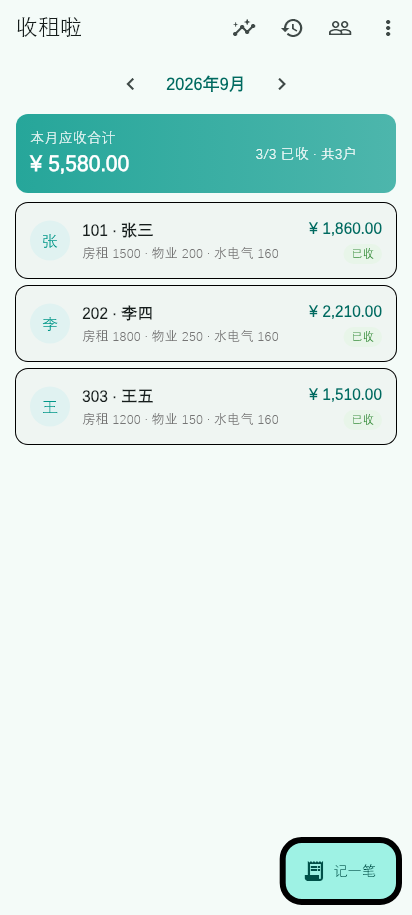
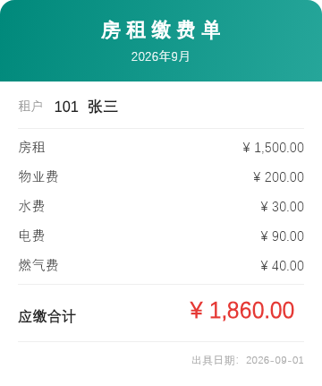
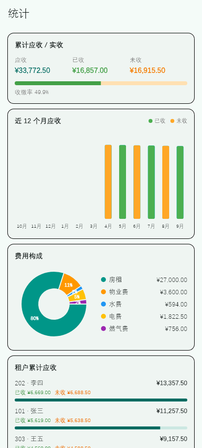
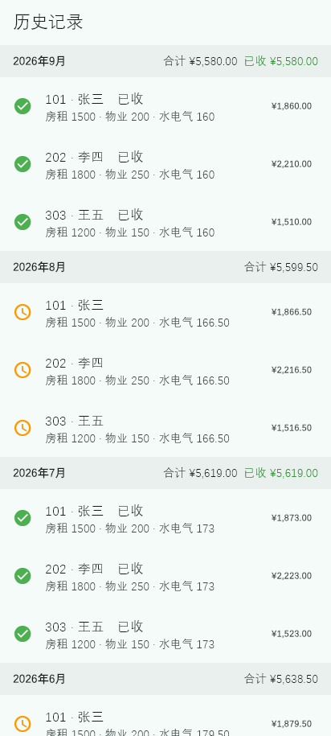
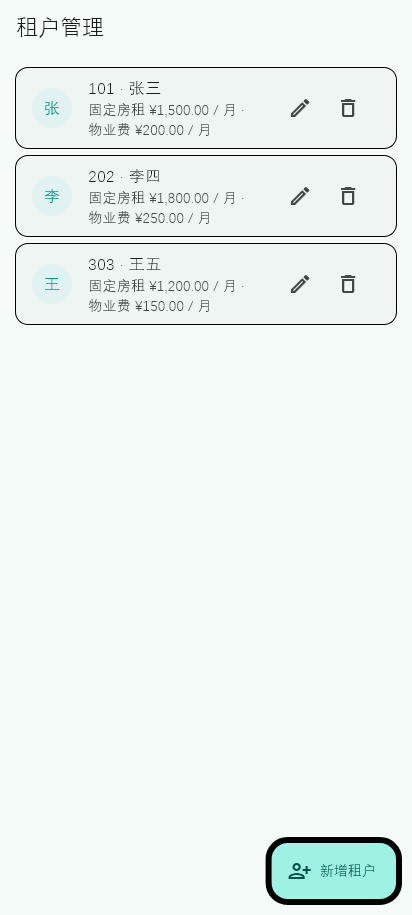

[English](README.en.md) | **简体中文**

<div align="center">

# 收租啦 · Rent Book

**给房东用的极简收租账本**<br>
按月记录房租、物业费与水电燃气费，一键生成账单图片分享给租客。

[](https://github.com/oliverchu/rent_book/actions/workflows/ci.yml)
[](https://flutter.dev)
[](https://dart.dev)
[](LICENSE)
[](#-支持平台)





</div>

---

## ✨ 功能

| | |
|---|---|
| 🏠 **租户管理** | 房号、姓名、固定房租与物业费，增删改一目了然 |
| 🧾 **按月记账** | 每位租户每月一条账单：房租 / 物业费 / 水费 / 电费 / 燃气费 + 备注，支持「已收 / 未收」 |
| 🗂 **历史记录** | 按月份倒序分组，显示当月合计与已收金额 |
| 📊 **统计** | 累计应收 / 已收 / 未收与收缴率、近 12 个月趋势、费用构成饼图、租户欠费排名 |
| 🖼 **账单分享** | 把账单渲染成图片，通过系统分享（微信等） |
| 🔒 **启动密码** | 设置 / 修改启动密码，切到后台回来自动上锁 |
| 🌐 **多语言** | English / 简体中文 / 日本語 / 한국어，应用内可切换（默认跟随系统） |
| 💱 **多货币** | CNY ¥ / USD $ / JPY ¥ / KRW ₩，应用内可切换（默认跟随语言） |

## 📸 截图

<table>
  <tr>
    <td></td>
    <td></td>
    <td></td>
  </tr>
  <tr>
    <td align="center">首页 · 按月汇总</td>
    <td align="center">历史记录</td>
    <td align="center">统计</td>
  </tr>
  <tr>
    <td></td>
    <td></td>
    <td></td>
  </tr>
  <tr>
    <td align="center">租户管理</td>
    <td align="center">账单卡片</td>
    <td></td>
  </tr>
</table>

## 🚀 快速开始

### 环境要求

- Flutter **3.47.1** 及以上（Dart 3.13+）
- Android：Android Studio / Android SDK
- Windows：Visual Studio 2022，勾选「使用 C++ 的桌面开发」工作负载

### 运行

```bash
git clone https://github.com/oliverchu/rent_book.git
cd rent_book
flutter pub get
flutter run          # 选择 Android 设备或 Windows
```

### 测试与静态分析

```bash
flutter analyze
flutter test
```

## 📦 构建

### Android

```bash
# 调试包
flutter build apk --debug

# 正式包（需先配置签名，见下）
flutter build apk --release          # 单 APK
flutter build appbundle --release    # Google Play 用 AAB
```

产物：`build/app/outputs/flutter-apk/app-release.apk`、
`build/app/outputs/bundle/release/app-release.aab`

#### 配置签名

复制模板并填入真实值（`android/key.properties` 已被 `.gitignore` 忽略）：

```bash
cp android/key.properties.example android/key.properties
```

```properties
storePassword=你的密钥库口令
keyPassword=你的口令
keyAlias=upload
storeFile=upload-keystore.jks
```

生成密钥库：

```bash
keytool -genkey -v -keystore android/app/upload-keystore.jks \
  -keyalg RSA -keysize 2048 -validity 10000 -alias upload
```

> 未配置 `key.properties` 时，release 构建会回退到 debug 签名，方便本地打包。

### Windows

```bash
flutter build windows --release
```

产物：`build/windows/x64/runner/Release/rent_book.exe`

## 🌐 本地化

文案位于 `lib/l10n/app_*.arb`，修改后重新生成：

```bash
flutter gen-l10n
```

生成结果 `lib/l10n/app_localizations*.dart` 已提交到仓库。
支持语言：`en` / `zh` / `ja` / `ko`。

## 🧱 项目结构

```
lib/
├── data/          # 数据源与仓储（SQLite、SharedPreferences、设置）
│   ├── datasources/
│   ├── repositories/
│   └── services/
├── domain/        # 模型（Tenant / Bill / Currency）
├── ui/
│   ├── core/      # 通用组件、金额/日期格式化、货币作用域
│   ├── features/  # auth / home / tenants / bill_edit / bill_share / stats
│   └── router/    # go_router 路由
└── l10n/          # ARB 文案与生成的本地化代码
```

## 🛠 技术栈

| | |
|---|---|
| UI | Flutter 3.47 · Material 3 |
| 状态管理 | [provider](https://pub.dev/packages/provider) |
| 路由 | [go_router](https://pub.dev/packages/go_router) |
| 本地存储 | [sqflite](https://pub.dev/packages/sqflite)（桌面端用 [sqflite_common_ffi](https://pub.dev/packages/sqflite_common_ffi)）· [shared_preferences](https://pub.dev/packages/shared_preferences) |
| 图表 | [fl_chart](https://pub.dev/packages/fl_chart) |
| 分享 | [share_plus](https://pub.dev/packages/share_plus) |
| 本地化 | flutter_localizations · intl |

## 🔐 数据与隐私

- 所有数据（租户、账单、密码哈希、语言/货币设置）都保存在**本机**，不联网、不上传。
- 账单存在 SQLite 数据库中；启动密码使用加盐 SHA-256 做门禁校验，**并非数据库加密**，请勿用它存放敏感信息。

## 🤝 贡献

欢迎 issue 和 PR。

1. Fork 本仓库
2. 新建分支：`git checkout -b feature/xxx`
3. 提交：`git commit -m "feat: xxx"`
4. 推送并开 PR

提交前请确保 `flutter analyze` 与 `flutter test` 均通过。

## 📄 许可证

[MIT](LICENSE)
